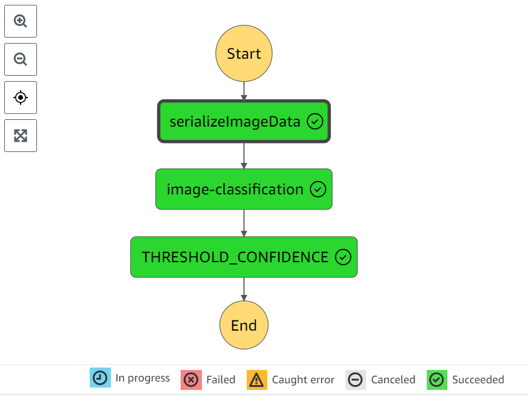

# Build_ML_Workflow_For_Scones_Unlimited_On_Amazon_SageMaker
Project: Build a ML Workflow For Scones Unlimited On Amazon SageMaker

# 1. Project Description
Image Classifiers are used in the field of computer vision to identify the content of an image and it is used across a broad variety of industries, from advanced technologies like autonomous vehicles and augmented reality, to eCommerce platforms, and even in diagnostic medicine.

#### In this project, we'll be building an image classification model that can automatically detect which kind of vehicle delivery drivers have, in order to route them to the correct loading bay and orders. Assigning delivery professionals who have a bicycle to nearby orders and giving motorcyclists orders that are farther can help Scones Unlimited optimize their operations.

#### So we build an image classification model that can tell bicycles apart from motorcycles.


# 2. Project Steps Overview
**Step 1:** Data staging </br>
**Step 2:** Model training and deployment </br>
**Step 3:** Lambdas and step function workflow </br>
**Step 4:** Testing and evaluation </br>

# 3.  Dependencies
```
Python 3 (Data Science) - v3.7.10 kernel
ml.t3.medium instance
Python 3.8 runtime for the AWS Lambda Functions
```

# 4. Workflow 
#### in this project we made an automate model using Sagemaker with thre [lambda function](https://github.com/khireddinemahaline/Build_ML_Workflow_For_Scones_Unlimited_On_Amazon_SageMaker/blob/823768ca2ab52f513867cdbbc9c8dad87f471bd3/lambda.py) and link them with step function as :  </br>

